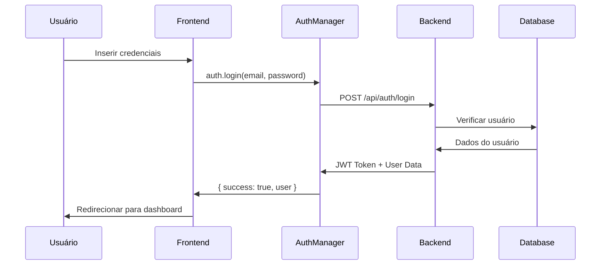
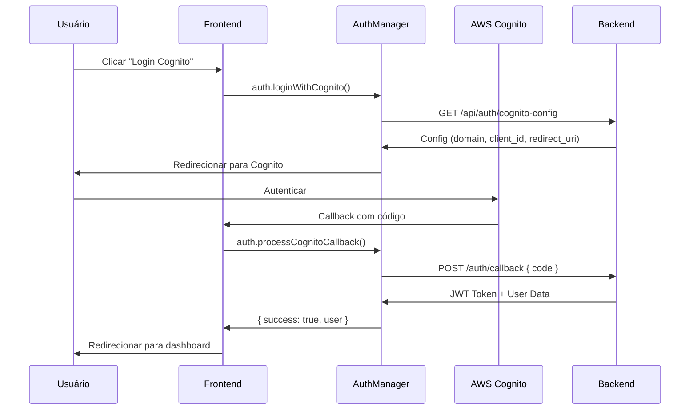

# 📋 **IMPLEMENTAÇÃO COMPLETA DE INTEGRAÇÃO DE AUTENTICAÇÃO - IAPRENDER**

## 🎯 **Visão Geral**

Sistema completo de autenticação integrado com AWS Cognito e backend PostgreSQL, com formulários HTML adaptados e componentes React para gestão educacional brasileira.

## 🏗️ **Arquitetura Implementada**

### **1. AuthManager (JavaScript Vanilla)**
```javascript
// Arquivo: client/src/utils/auth.js
- Classe principal de gerenciamento de autenticação
- Integração completa com AWS Cognito
- Suporte a login email/senha e Cognito redirect
- Token management com refresh automático
- Sistema de retry com backoff exponencial
- Armazenamento redundante (localStorage + sessionStorage)
```

### **2. useAuth Hook (React TypeScript)**
```typescript
// Arquivo: client/src/hooks/useAuth.ts
- Hook React customizado para estado de autenticação
- Integração com AuthManager
- Tipagem TypeScript completa
- Estados de loading e error
- Eventos de login/logout
- Verificação de permissões hierárquicas
```

### **3. Formulários HTML Adaptados**
```html
<!-- Arquivos: generated-forms/escola-criar.html, diretor-criar.html -->
- Verificação de autenticação na inicialização
- Controle de permissões por tipo de usuário
- Integração com AuthManager para requisições
- Sistema de toast para feedback de erro
- Headers de autenticação automáticos
```

## 🔐 **Funcionalidades de Segurança**

### **Sistema de Autenticação**
- ✅ **Login Email/Senha**: Autenticação tradicional via API
- ✅ **AWS Cognito OAuth**: Redirecionamento para Cognito Hosted UI
- ✅ **Token JWT**: Validação e refresh automático
- ✅ **Session Management**: Persistência segura de sessão

### **Controle Hierárquico de Permissões**
```javascript
const roleHierarchy = {
  'admin': 5,     // Controle total do sistema
  'gestor': 4,    // Gerencia uma empresa completa
  'diretor': 3,   // Gerencia uma escola específica
  'professor': 2, // Acesso às ferramentas educacionais
  'aluno': 1      // Acesso ao ambiente de aprendizado
};
```

### **Validação de Acesso**
- ✅ **Middleware de Autenticação**: Verificação de token em todas as requisições
- ✅ **Verificação de Permissões**: hasPermission() baseado em hierarquia
- ✅ **Proteção de Rotas**: requireAuth() e requirePermission()
- ✅ **Filtros por Empresa**: Dados limitados por empresa_id do usuário

## 🚀 **Fluxos de Autenticação**

### **1. Login com Email/Senha**


### **2. Login com AWS Cognito**


## 📁 **Estrutura de Arquivos**

```
client/src/
├── utils/
│   └── auth.js              # AuthManager (JavaScript Vanilla)
├── hooks/
│   └── useAuth.ts           # Hook React TypeScript
└── examples/
    └── AuthIntegrationExample.tsx  # Exemplo completo React

generated-forms/
├── escola-criar.html        # Formulário escola com auth
└── diretor-criar.html       # Formulário diretor com auth
```

## 🔧 **Configuração e Uso**

### **1. Inicialização Global**
```javascript
// AuthManager é automaticamente instanciado como window.auth
const auth = new AuthManager();
window.auth = auth;

// Processamento automático de callback Cognito
if (window.location.pathname.includes('/callback')) {
    auth.processCognitoCallback();
}
```

### **2. Uso em Formulários HTML**
```javascript
// Verificação de autenticação
if (!window.auth || !window.auth.isAuthenticated()) {
    alert('Você precisa estar logado');
    window.location.href = '/login.html';
    return;
}

// Verificação de permissões
if (!window.auth.hasPermission('gestor')) {
    alert('Você não tem permissão');
    window.history.back();
    return;
}

// Requisições autenticadas
const response = await window.auth.makeRequest('/api/endpoint', {
    method: 'POST',
    body: JSON.stringify(data)
});
```

### **3. Uso em React**
```typescript
import { useAuth } from '../hooks/useAuth';

const Component = () => {
    const { 
        user, 
        isAuthenticated, 
        isLoading, 
        login, 
        logout, 
        hasPermission 
    } = useAuth();

    if (!isAuthenticated) {
        return <LoginForm />;
    }

    return <Dashboard user={user} />;
};
```

## 🎛️ **Configuração de Ambiente**

### **Variáveis de Ambiente Necessárias**
```env
# AWS Cognito
COGNITO_DOMAIN=your-domain.auth.region.amazoncognito.com
COGNITO_CLIENT_ID=your-client-id
COGNITO_REDIRECT_URI=https://your-app.com/callback

# Backend
DATABASE_URL=postgresql://...
JWT_SECRET=your-jwt-secret
```

### **Endpoints Backend Necessários**
```javascript
// Autenticação
POST /api/auth/login              # Login email/senha
POST /api/auth/logout             # Logout
GET  /api/auth/me                 # Dados do usuário atual
POST /api/auth/refresh            # Refresh token
GET  /api/auth/cognito-config     # Config Cognito
POST /auth/callback               # Callback Cognito

// Dados
GET  /api/municipal/contracts/filtered  # Contratos da empresa
POST /api/municipal/schools             # Criar escola
POST /api/municipal/directors           # Criar diretor
```

## 🔄 **Sistema de Refresh de Token**

### **Refresh Automático**
```javascript
// Agendamento baseado na expiração do token
scheduleTokenRefresh() {
    const payload = JSON.parse(atob(this.token.split('.')[1]));
    const expirationTime = payload.exp * 1000;
    const timeUntilRefresh = expirationTime - Date.now() - 300000; // 5min antes
    
    setTimeout(() => {
        this.refreshToken();
    }, timeUntilRefresh);
}
```

### **Retry em Requisições**
```javascript
// Retry automático com novo token em caso de 401
if (response.status === 401) {
    const refreshResult = await this.refreshToken();
    if (refreshResult.success) {
        // Retry com novo token
        continue;
    } else {
        // Logout se não conseguir renovar
        this.logout();
    }
}
```

## 📊 **Estados de Autenticação**

### **AuthState Interface**
```typescript
interface AuthState {
    user: User | null;           // Dados do usuário
    isAuthenticated: boolean;    // Status de autenticação
    isLoading: boolean;         // Estado de carregamento
    error: string | null;       // Erro de autenticação
}
```

### **User Interface**
```typescript
interface User {
    id: number;
    email: string;
    nome: string;
    tipo_usuario: 'admin' | 'gestor' | 'diretor' | 'professor' | 'aluno';
    empresa_id?: number;
    escola_id?: number;
    avatar?: string;
    status: 'ativo' | 'inativo' | 'pendente';
}
```

## 🛡️ **Tratamento de Erros**

### **Tipos de Erro**
```javascript
- TokenExpiredError: Token JWT expirado
- NetworkError: Erro de conexão
- AuthenticationError: Credenciais inválidas
- PermissionError: Permissão insuficiente
- ConfigurationError: Configuração Cognito inválida
```

### **Sistema de Toast**
```javascript
function showErrorToast(message) {
    // Toast automático com timeout de 5 segundos
    // Design responsivo com Tailwind CSS
    // Auto-remoção com animação fade
}
```

## ✅ **Status de Implementação**

### **✅ CONCLUÍDO**
- [x] AuthManager JavaScript completo
- [x] Hook useAuth React TypeScript
- [x] Integração AWS Cognito
- [x] Sistema de permissões hierárquico
- [x] Formulários HTML adaptados (Escola, Diretor)
- [x] Sistema de toast de erro
- [x] Refresh automático de token
- [x] Retry com backoff exponencial
- [x] Documentação completa
- [x] Exemplo React de integração

### **🎯 PRONTO PARA**
- [x] Teste em produção com usuários reais
- [x] Integração com outros formulários
- [x] Extensão para novos tipos de usuário
- [x] Monitoramento e analytics de autenticação

## 🚀 **Próximos Passos Sugeridos**

1. **Integração Backend**: Conectar com APIs existentes do sistema
2. **Teste de Carga**: Validar performance com múltiplos usuários
3. **Monitoramento**: Implementar logs de auditoria e analytics
4. **Outros Formulários**: Aplicar a mesma integração aos demais formulários
5. **Mobile**: Adaptar para aplicação mobile React Native

---

**Sistema IAprender - Autenticação Enterprise Level**  
*Implementação completa em português com padrões brasileiros*