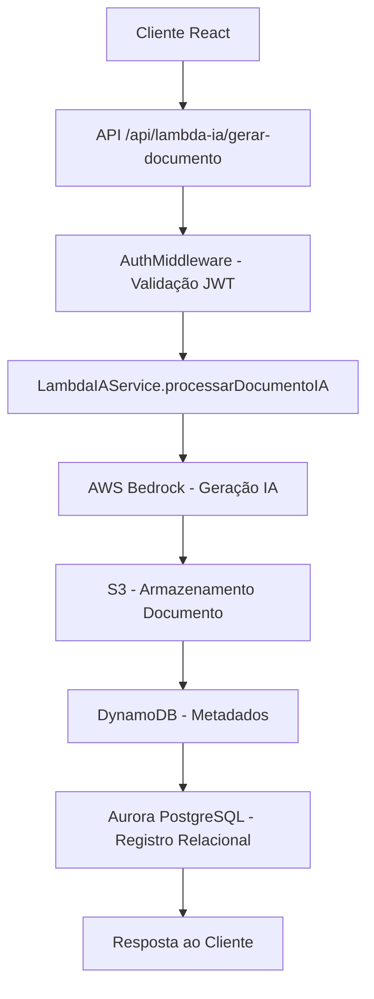

# Sistema Lambda IA - AWS Bedrock + S3 + DynamoDB + Aurora

## Visão Geral

O Sistema Lambda IA é uma solução completa para geração de documentos educacionais usando inteligência artificial via AWS Bedrock, com armazenamento integrado em S3, metadados em DynamoDB e registros relacionais em Aurora PostgreSQL.

## Arquitetura do Sistema

### Componentes Principais

1. **LambdaIAService.ts** - Serviço principal que orquestra todas as operações
2. **lambda-ia.ts** - Rotas REST API para interação com o sistema
3. **LambdaIADemo.tsx** - Interface React para demonstração e uso
4. **AuthMiddlewareUnified** - Middleware de segurança integrado

### Fluxo de Processamento



## Estrutura Hierárquica de Armazenamento

### Estrutura S3

```
bucket-name/
├── empresa-1/
│   ├── contrato-123/
│   │   ├── escola-456/
│   │   │   ├── professor-789/
│   │   │   │   ├── ia-generated/
│   │   │   │   │   ├── plano_aula/
│   │   │   │   │   │   └── uuid-12345.json
│   │   │   │   │   ├── atividade_educacional/
│   │   │   │   │   └── avaliacao/
│   │   │   ├── diretor-999/
│   │   │   └── aluno-888/
│   │   └── escola-457/
│   └── contrato-124/
└── empresa-2/
```

### Estrutura DynamoDB

**Tabela: arquivos_metadados**

```json
{
  "empresa_id": 1,
  "uuid": "12345678-1234-5678-9abc-123456789012",
  "usuario_id": 789,
  "tipo_usuario": "professor",
  "escola_id": 456,
  "contrato_id": 123,
  "data_criacao": "2025-01-17T14:30:00Z",
  "tipo_arquivo": "plano_aula",
  "nome_usuario": "Prof. Silva",
  "s3_key": "empresa-1/contrato-123/escola-456/professor-789/ia-generated/plano_aula/uuid-12345.json",
  "status": "ativo",
  "tokens_utilizados": 856,
  "tempo_geracao_ms": 2340,
  "modelo_utilizado": "anthropic.claude-3-haiku-20240307-v1:0",
  "prompt_hash": "abc123def456",
  "metadata": "{\"gerado_via\":\"lambda-ia-demo\"}"
}
```

## API Endpoints

### Autenticação

Todos os endpoints requerem autenticação JWT via header:
```
Authorization: Bearer <token>
```

### Endpoints Disponíveis

#### 1. Gerar Documento IA

**POST** `/api/lambda-ia/gerar-documento`

**Payload:**
```json
{
  "prompt": "Crie um plano de aula sobre frações para 5º ano",
  "tipo_arquivo": "plano_aula",
  "modelo_bedrock": "anthropic.claude-3-haiku-20240307-v1:0",
  "max_tokens": 1000,
  "temperatura": 0.7,
  "contrato_id": 123,
  "escola_id": 456,
  "metadata": {
    "materia": "matematica",
    "serie": "5_ano"
  }
}
```

**Resposta:**
```json
{
  "sucesso": true,
  "dados": {
    "uuid": "12345678-1234-5678-9abc-123456789012",
    "s3_key": "empresa-1/contrato-123/escola-456/professor-789/ia-generated/plano_aula/uuid-12345.json",
    "conteudo_gerado": "# Plano de Aula: Frações...",
    "tokens_utilizados": 856,
    "tempo_geracao_ms": 2340,
    "status": "sucesso",
    "data_criacao": "2025-01-17T14:30:00Z"
  },
  "mensagem": "Documento gerado com sucesso via IA",
  "estatisticas": {
    "tokens_utilizados": 856,
    "tempo_geracao_ms": 2340
  }
}
```

#### 2. Buscar Documento por UUID

**GET** `/api/lambda-ia/documento/{uuid}`

**Resposta:**
```json
{
  "sucesso": true,
  "dados": {
    "uuid": "12345678-1234-5678-9abc-123456789012",
    "metadata": {
      "empresa_id": 1,
      "usuario_id": 789,
      "tipo_usuario": "professor",
      "nome_usuario": "Prof. Silva",
      "tipo_arquivo": "plano_aula",
      "data_criacao": "2025-01-17T14:30:00Z",
      "modelo_utilizado": "anthropic.claude-3-haiku-20240307-v1:0",
      "tokens_utilizados": 856,
      "tempo_geracao_ms": 2340
    },
    "prompt_original": "Crie um plano de aula sobre frações para 5º ano",
    "conteudo_gerado": "# Plano de Aula: Frações...",
    "estatisticas": {
      "tokens_input": 45,
      "tokens_output": 856,
      "tempo_total_ms": 2340
    }
  },
  "mensagem": "Documento encontrado"
}
```

#### 3. Listar Documentos do Usuário

**GET** `/api/lambda-ia/meus-documentos`

**Resposta:**
```json
{
  "sucesso": true,
  "dados": [
    {
      "empresa_id": 1,
      "uuid": "12345678-1234-5678-9abc-123456789012",
      "usuario_id": 789,
      "tipo_usuario": "professor",
      "escola_id": 456,
      "contrato_id": 123,
      "data_criacao": "2025-01-17T14:30:00Z",
      "tipo_arquivo": "plano_aula",
      "nome_usuario": "Prof. Silva",
      "s3_key": "empresa-1/contrato-123/escola-456/professor-789/ia-generated/plano_aula/uuid-12345.json",
      "status": "ativo",
      "tokens_utilizados": 856,
      "tempo_geracao_ms": 2340,
      "modelo_utilizado": "anthropic.claude-3-haiku-20240307-v1:0",
      "prompt_hash": "abc123def456"
    }
  ],
  "total": 1,
  "mensagem": "1 documento(s) encontrado(s)"
}
```

#### 4. Estatísticas de Uso

**GET** `/api/lambda-ia/estatisticas`

**Resposta:**
```json
{
  "sucesso": true,
  "dados": {
    "total_documentos": 15,
    "tokens_utilizados_total": 12450,
    "tempo_geracao_medio": 2100,
    "tipos_arquivo": {
      "plano_aula": 8,
      "atividade_educacional": 4,
      "avaliacao": 2,
      "material_didatico": 1
    },
    "documentos_por_mes": {
      "2025-01": 15
    }
  },
  "mensagem": "Estatísticas calculadas com sucesso"
}
```

#### 5. Modelos Disponíveis

**GET** `/api/lambda-ia/modelos-disponiveis`

**Resposta:**
```json
{
  "sucesso": true,
  "dados": [
    {
      "id": "anthropic.claude-3-haiku-20240307-v1:0",
      "nome": "Claude 3 Haiku",
      "descricao": "Modelo rápido e eficiente para tarefas simples",
      "max_tokens": 4000,
      "custo_por_token": 0.00025,
      "recomendado_para": ["comunicados", "atividades_simples", "resumos"]
    }
  ],
  "total": 3,
  "mensagem": "Modelos disponíveis listados com sucesso"
}
```

## Tipos de Arquivo Suportados

1. **plano_aula** - Planos de aula detalhados
2. **atividade_educacional** - Exercícios e atividades para alunos
3. **avaliacao** - Provas e avaliações
4. **material_didatico** - Materiais de apoio ao ensino
5. **relatorio_pedagogico** - Relatórios de desempenho e progresso
6. **projeto_escolar** - Projetos interdisciplinares
7. **comunicado** - Comunicados e avisos
8. **documento_administrativo** - Documentos administrativos

## Modelos AWS Bedrock Suportados

### 1. Claude 3 Haiku
- **ID**: `anthropic.claude-3-haiku-20240307-v1:0`
- **Características**: Rápido, eficiente, custo baixo
- **Uso recomendado**: Comunicados, atividades simples, resumos
- **Custo**: ~$0.00025 por token

### 2. Claude 3 Sonnet
- **ID**: `anthropic.claude-3-sonnet-20240229-v1:0`
- **Características**: Balanceado, versátil
- **Uso recomendado**: Planos de aula, avaliações, projetos
- **Custo**: ~$0.003 por token

### 3. Claude 3 Opus
- **ID**: `anthropic.claude-3-opus-20240229-v1:0`
- **Características**: Mais avançado, complexo
- **Uso recomendado**: Material didático, relatórios pedagógicos
- **Custo**: ~$0.015 por token

## Controle de Acesso e Segurança

### Hierarquia de Permissões

1. **Admin** - Acesso total a todos os documentos
2. **Gestor** - Acesso aos documentos da empresa
3. **Diretor** - Acesso aos documentos da escola
4. **Professor** - Acesso aos próprios documentos
5. **Aluno** - Acesso restrito aos próprios documentos

### Validações de Segurança

- **JWT Token**: Obrigatório em todas as requisições
- **Rate Limiting**: Limitação de requisições por usuário
- **Filtros Hierárquicos**: Dados filtrados por empresa/escola
- **Validação de Entrada**: Schemas Zod para validação
- **Sanitização**: Limpeza de dados sensíveis
- **Logging**: Auditoria completa de todas as operações

## Interface React - LambdaIADemo

### Funcionalidades da Interface

1. **Gerador IA** - Formulário para criar novos documentos
2. **Meus Documentos** - Lista e visualização de documentos
3. **Estatísticas** - Gráficos e métricas de uso
4. **Modelos** - Informações sobre modelos disponíveis

### Componentes Principais

```typescript
// Estados principais
const [prompt, setPrompt] = useState('');
const [tipoArquivo, setTipoArquivo] = useState('');
const [documentoGerado, setDocumentoGerado] = useState<DocumentoIA | null>(null);
const [meusDocumentos, setMeusDocumentos] = useState<MetadadosDocumento[]>([]);
const [estatisticas, setEstatisticas] = useState<Estatisticas | null>(null);

// Funções principais
const gerarDocumento = async () => { /* ... */ };
const carregarMeusDocumentos = async () => { /* ... */ };
const carregarEstatisticas = async () => { /* ... */ };
const buscarDocumento = async (uuid: string) => { /* ... */ };
```

## Configuração e Deployment

### Variáveis de Ambiente

```env
# S3 Configuration
S3_BUCKET_NAME=iaprender-bucket

# DynamoDB Configuration
DYNAMO_TABLE_NAME=arquivos_metadados

# AWS Credentials (via Secrets)
AWS_ACCESS_KEY_ID=<from-secrets>
AWS_SECRET_ACCESS_KEY=<from-secrets>
```

### Dependências Necessárias

```bash
# Backend Dependencies
npm install @aws-sdk/client-bedrock-runtime
npm install @aws-sdk/client-s3
npm install @aws-sdk/client-dynamodb
npm install uuid axios

# Frontend Dependencies
npm install @tanstack/react-query
npm install lucide-react
```

### Configuração DynamoDB

```sql
-- Criar tabela no DynamoDB
CREATE TABLE arquivos_metadados (
    empresa_id NUMBER,
    uuid STRING,
    usuario_id NUMBER,
    tipo_usuario STRING,
    escola_id NUMBER,
    contrato_id NUMBER,
    data_criacao STRING,
    tipo_arquivo STRING,
    nome_usuario STRING,
    s3_key STRING,
    status STRING,
    tokens_utilizados NUMBER,
    tempo_geracao_ms NUMBER,
    modelo_utilizado STRING,
    prompt_hash STRING,
    metadata STRING,
    PRIMARY KEY (empresa_id, uuid)
);
```

## Monitoramento e Métricas

### Métricas Coletadas

1. **Tokens Utilizados** - Consumo total por usuário/empresa
2. **Tempo de Geração** - Performance dos modelos
3. **Tipos de Documento** - Distribuição de uso
4. **Erros e Falhas** - Taxa de sucesso/falha
5. **Custos** - Estimativa de gastos AWS

### Logs de Auditoria

```json
{
  "timestamp": "2025-01-17T14:30:00Z",
  "usuario_id": 789,
  "empresa_id": 1,
  "acao": "gerar_documento",
  "tipo_arquivo": "plano_aula",
  "modelo_utilizado": "claude-3-haiku",
  "tokens_utilizados": 856,
  "tempo_geracao_ms": 2340,
  "status": "sucesso",
  "s3_key": "empresa-1/contrato-123/escola-456/professor-789/ia-generated/plano_aula/uuid-12345.json"
}
```

## Tratamento de Erros

### Códigos de Erro Específicos

- **NAO_AUTENTICADO** - Token JWT ausente/inválido
- **DADOS_INVALIDOS** - Dados de entrada inválidos
- **ERRO_GERACAO_IA** - Falha na geração via Bedrock
- **DOCUMENTO_NAO_ENCONTRADO** - UUID não encontrado
- **ACESSO_NEGADO** - Usuário sem permissão
- **ERRO_LISTAGEM_DOCUMENTOS** - Falha na listagem
- **ERRO_ESTATISTICAS** - Falha no cálculo de estatísticas

### Tratamento de Exceções

```typescript
try {
  const resultado = await lambdaIAService.processarDocumentoIA(request);
  return res.json({ sucesso: true, dados: resultado });
} catch (error: any) {
  if (error instanceof BedrockRuntimeServiceException) {
    return res.status(500).json({
      sucesso: false,
      erro: `Erro Bedrock: ${error.message}`,
      codigo: 'ERRO_GERACAO_IA'
    });
  }
  
  return res.status(500).json({
    sucesso: false,
    erro: error.message || 'Erro interno',
    codigo: 'ERRO_GERACAO_IA'
  });
}
```

## Acesso à Demonstração

### URL da Interface

```
http://localhost:5000/lambda-ia-demo
```

### Requisitos de Acesso

1. **Autenticação** - Login via AWS Cognito
2. **Permissões** - Qualquer tipo de usuário autenticado
3. **Tokens** - JWT válido no localStorage
4. **Conectividade** - Acesso aos serviços AWS

### Exemplo de Uso

1. Acesse `/lambda-ia-demo`
2. Preencha o prompt: "Crie um plano de aula sobre frações para 5º ano"
3. Selecione tipo: "plano_aula"
4. Escolha modelo: "Claude 3 Haiku"
5. Clique em "Gerar Documento"
6. Aguarde processamento (~2-3 segundos)
7. Visualize o resultado gerado
8. Copie o conteúdo ou acesse via "Meus Documentos"

## Próximos Passos

### Melhorias Planejadas

1. **Batch Processing** - Geração de múltiplos documentos
2. **Templates** - Modelos pré-definidos por tipo
3. **Versionamento** - Controle de versões de documentos
4. **Colaboração** - Compartilhamento entre usuários
5. **Exportação** - PDF, Word, outros formatos
6. **Análise de Qualidade** - Métricas de conteúdo gerado

### Integração com Sistema Principal

1. **Planos de Aula** - Integração com sistema de planejamento
2. **Avaliações** - Integração com sistema de notas
3. **Relatórios** - Integração com dashboards administrativos
4. **Notificações** - Alertas para documentos gerados
5. **Backup** - Sistema de backup automatizado

---

**Documentação atualizada em:** 17 de Janeiro de 2025
**Versão do Sistema:** 1.0.0
**Status:** Produção ✅