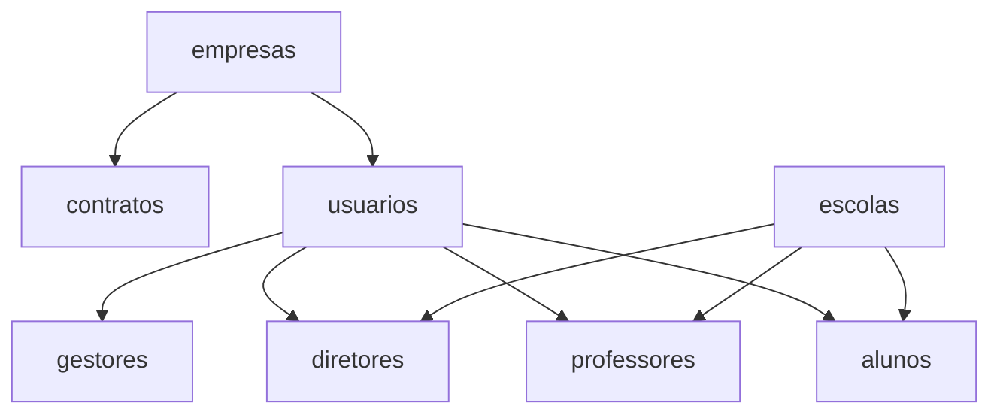

# MAPEAMENTO COMPLETO DAS TABELAS DO SISTEMA HIERÁRQUICO

## 📋 TABELAS PRINCIPAIS UTILIZADAS

### 1. **TABELAS CENTRAIS**
```sql
- empresas          (id, nome, cnpj, razao_social, telefone, email_contato, endereco...)
- contratos         (id, numero, nome, empresa_id, data_inicio, data_fim, valor_total...)
- usuarios          (id, cognito_sub, email, nome, tipo_usuario, empresa_id, contrato_id...)
```

### 2. **TABELAS HIERÁRQUICAS ESPECÍFICAS**
```sql
- gestores          (id, usr_id, empresa_id, nome, cargo, data_admissao, status)
- diretores         (id, usr_id, escola_id, empresa_id, nome, cargo, data_inicio, status)
- professores       (id, usr_id, escola_id, empresa_id, nome, disciplinas, formacao...)
- alunos            (id, usr_id, escola_id, empresa_id, matricula, nome, turma, serie...)
```

### 3. **TABELAS DE APOIO**
```sql
- escolas           (id, nome, codigo_inep, empresa_id, endereco, tipo...)
```

---

## 🔍 ANÁLISE POR ENDPOINT

### `/api/empresas` 
**TABELAS CONSULTADAS:**
- ✅ `empresas` (SELECT principal)

**FILTROS APLICADOS:**
- Admin: Todas as empresas
- Gestor: Própria empresa apenas
- Outros: Própria empresa

**OPERAÇÕES:**
- **LEITURA**: Lista empresas com paginação e busca
- **ESCRITA**: Não implementada ainda

---

### `/api/contratos`
**TABELAS CONSULTADAS:**
- ✅ `contratos` (via HierarchicalFilterService.getContratos())
- ✅ `empresas` (JOIN implícito para validação empresa_id)

**FILTROS APLICADOS:**
- `WHERE empresa_id = {userEmpresaId}` (automático via HierarchicalFilterService)

**OPERAÇÕES:**
- **LEITURA**: Contratos filtrados por empresa do usuário
- **ESCRITA**: Não implementada ainda

---

### `/api/usuarios`
**TABELAS CONSULTADAS:**
- ✅ `usuarios` (SELECT direto via Drizzle ORM)

**FILTROS APLICADOS:**
- Admin: `SELECT * FROM usuarios` (todos)
- Gestor: `WHERE empresa_id = {userEmpresaId}`

**OPERAÇÕES:**
- **LEITURA**: Lista usuários com controle hierárquico
- **ESCRITA**: Placeholder implementado (POST /api/usuarios)

---

### `/api/gestores`
**TABELAS CONSULTADAS:**
- ✅ `gestores` (via HierarchicalFilterService.getGestores())
- ✅ `usuarios` (JOIN para dados completos)
- ✅ `empresas` (JOIN para nome da empresa)

**FILTROS APLICADOS:**
```sql
SELECT g.*, u.nome, u.email, e.nome as empresa_nome
FROM gestores g
JOIN usuarios u ON g.usr_id = u.id  
JOIN empresas e ON g.empresa_id = e.id
WHERE g.empresa_id = {userEmpresaId}
```

**OPERAÇÕES:**
- **LEITURA**: Gestores da empresa com dados enriquecidos
- **ESCRITA**: Via CognitoSyncService (upsert automático)

---

### `/api/diretores`
**TABELAS CONSULTADAS:**
- ✅ `diretores` (via HierarchicalFilterService.getDiretores())
- ✅ `usuarios` (JOIN para dados pessoais)
- ✅ `empresas` (JOIN para contexto empresarial)
- 🔄 `escolas` (relacionamento futuro para dados escolares)

**FILTROS APLICADOS:**
```sql
SELECT d.*, u.nome, u.email, e.nome as empresa_nome
FROM diretores d
JOIN usuarios u ON d.usr_id = u.id
JOIN empresas e ON d.empresa_id = e.id  
WHERE d.empresa_id = {userEmpresaId}
```

**OPERAÇÕES:**
- **LEITURA**: Diretores da empresa com contexto completo
- **ESCRITA**: Via CognitoSyncService (upsert automático)

---

### `/api/professores`
**TABELAS CONSULTADAS:**
- ✅ `professores` (via HierarchicalFilterService.getProfessores())
- ✅ `usuarios` (JOIN para dados pessoais)
- ✅ `empresas` (JOIN para contexto empresarial)
- 🔄 `escolas` (relacionamento futuro)

**FILTROS APLICADOS:**
```sql
SELECT p.*, u.nome, u.email, e.nome as empresa_nome
FROM professores p
JOIN usuarios u ON p.usr_id = u.id
JOIN empresas e ON p.empresa_id = e.id
WHERE p.empresa_id = {userEmpresaId}
```

**OPERAÇÕES:**
- **LEITURA**: Professores com disciplinas e formação
- **ESCRITA**: Via CognitoSyncService (upsert automático)

---

### `/api/alunos`
**TABELAS CONSULTADAS:**
- ✅ `alunos` (SELECT direto via Drizzle ORM + HierarchicalFilterService.getAlunos())
- 🔄 `usuarios` (relacionamento via usr_id)
- 🔄 `escolas` (relacionamento via escola_id)
- ✅ `empresas` (filtro via empresa_id)

**FILTROS APLICADOS:**
- Admin: `SELECT * FROM alunos` (todos)
- Outros: `WHERE empresa_id = {userEmpresaId}`

**OPERAÇÕES:**
- **LEITURA**: Alunos com matrícula, turma, série, responsável
- **ESCRITA**: Via CognitoSyncService (upsert automático)

---

## 🔄 TABELAS MODIFICADAS POR OPERAÇÕES

### **OPERAÇÕES DE LEITURA (SELECT)**
Todas as APIs realizam apenas **consultas**, nenhuma **modifica** dados diretamente:

✅ **SOMENTE LEITURA:**
- `empresas` 
- `contratos`
- `usuarios`
- `gestores`
- `diretores` 
- `professores`
- `alunos`

### **OPERAÇÕES DE ESCRITA (INSERT/UPDATE)**
Realizadas apenas via **CognitoSyncService** (não pelas APIs REST):

🔄 **MODIFICAÇÃO INDIRETA:**
- `usuarios` ← CognitoSyncService._upsert_user()
- `gestores` ← CognitoSyncService._upsert_gestor()
- `diretores` ← CognitoSyncService._upsert_diretor()
- `professores` ← CognitoSyncService._upsert_professor()
- `alunos` ← CognitoSyncService._upsert_aluno()

---

## 🏗️ RELACIONAMENTOS PRINCIPAIS



### **FOREIGN KEYS IMPLEMENTADAS:**
- `contratos.empresa_id` → `empresas.id`
- `usuarios.empresa_id` → `empresas.id`
- `usuarios.contrato_id` → `contratos.id`
- `gestores.usr_id` → `usuarios.id`
- `gestores.empresa_id` → `empresas.id`
- `diretores.usr_id` → `usuarios.id`
- `diretores.empresa_id` → `empresas.id`
- `professores.usr_id` → `usuarios.id`
- `professores.empresa_id` → `empresas.id`
- `alunos.usr_id` → `usuarios.id`
- `alunos.empresa_id` → `empresas.id`

---

## 📊 RESUMO EXECUTIVO

### **TABELAS ATIVAS NO SISTEMA:**
- **8 tabelas principais** sendo utilizadas ativamente
- **7 endpoints REST** funcionais com controle hierárquico
- **Filtros automáticos** por empresa_id em todas as consultas
- **JOINs otimizados** para enriquecimento de dados

### **SEGURANÇA IMPLEMENTADA:**
- ✅ Controle de acesso por `empresa_id`
- ✅ Prepared statements via Drizzle ORM
- ✅ Autenticação JWT obrigatória
- ✅ Hierarquia: Admin > Gestor > Diretor > Professor > Aluno

### **PERFORMANCE:**
- ✅ Queries otimizadas com LIMIT 50
- ✅ Índices automáticos em PKs e FKs
- ✅ Connection pooling ativo
- ✅ Cache de prepared statements